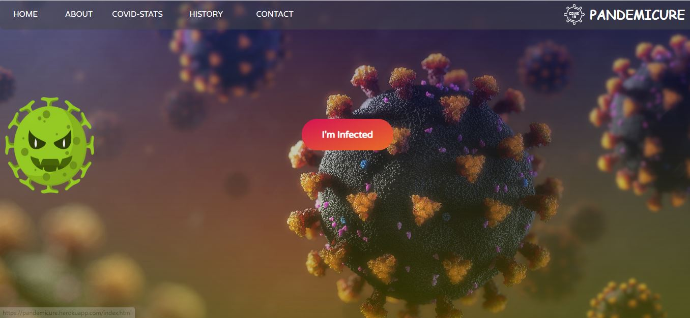
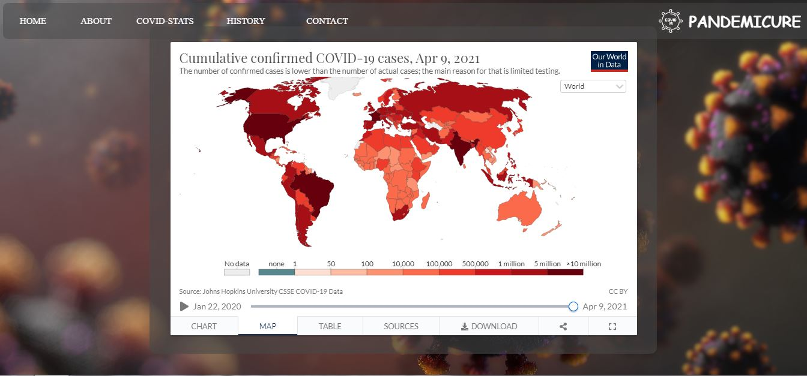

# Hack-36-Hackathon


<h3 align="left">Introduction:</h3>


We have made a very simple desktop UI based web application where an infected person can request for his/her treatment to near by Hospital just by filling the details.
After submission of Details our will send you a mail which will contain the details of treatment.


<h3 align="left">Tech Stack used :</h3> 


<p align="left"> <a href="https://getbootstrap.com" target="_blank">  </a> <a href="https://www.w3schools.com/css/" target="_blank">  </a> <a href="https://www.w3.org/html/" target="_blank">  </a> <a href="https://developer.mozilla.org/en-US/docs/Web/JavaScript" target="_blank">  </a> <a href="https://www.mysql.com/" target="_blank">  </a> <a href="https://www.php.net" target="_blank">  </a> <a href="https://sass-lang.com" target="_blank">  </a> </p>


### Team Name : ***Wemb Develomper***


<h3 align="left">Team Members : </h3> 

 - [Vijay Gupta](https://github.com/vijaygupta18)
 
 - [Mayank Pratap](https://github.com/mynkprtp)


###  [Click here to visit the site](https://pandemicure.herokuapp.com/)


###  Details required from PERSON:

+ Person's Name

+ Person's Email

+ Complete Address

+ Phone Number

## How it Works :

- User Details will be saved in Database

- System and our team will Look for Hospitals by User Details

- If Details found then System will Send a mail to the User which will contain the details of treatment.


## Website Contains :

#### 1: Homepaage which will have the submission details.
<br>



#### 2: About Pandemic,Cure and Precautions.


#### 3: History of all the Pandemics and how we overcame that pandemic.



#### 4: Covid-19 Stats of different countries and states.


#### 5: Contact page for queries regarding services and support.


```diff
@@ Feel free to contact us for PRs and Improvements in this project. @@

